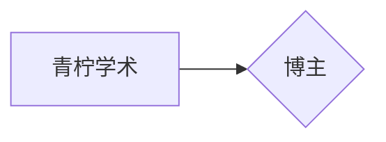

点击返回[🔗我的博客文章目录](https://percheung.github.io/#/toc)
* 目录
{:toc}
<div onclick="window.scrollTo({top:0,behavior:'smooth'});" style="background-color:white;position:fixed;bottom:20px;right:40px;padding:10px 10px 5px 10px;cursor:pointer;z-index:10;border-radius:13%;box-shadow:0.5px 3px 7px rgba(0,0,0,0.3);"></div>

# Typora绘制思维导图

## 1.我要绘制的思维导图是什么样的？

在我的上一篇博客[群里提问的艺术](https://percheung.github.io/blog/群里提问的艺术)里，我画了这样一个思维导图。


> 本文的目标就是，用typora直接复现这个思维导图。

## 2.Typora绘制思维导图的思路

我们观察一下，其实思维导图就是树状结构的数据嘛，作为程序员，拿语言写树状结构的数据是很平常的事情。而且写代码可比画图省事多了，查阅资料可以知道，有一种`mermaid`语法，就是做这件事情的，支持 UML，甘特图，流程图等。

**重要的是，Typora就支持写mermaid。**

## 3.开始绘制

### 3.1 绘制前的准备工作（语法讲解）

```bash
graph LR
A[青柠学术]-->B{博主}
```




