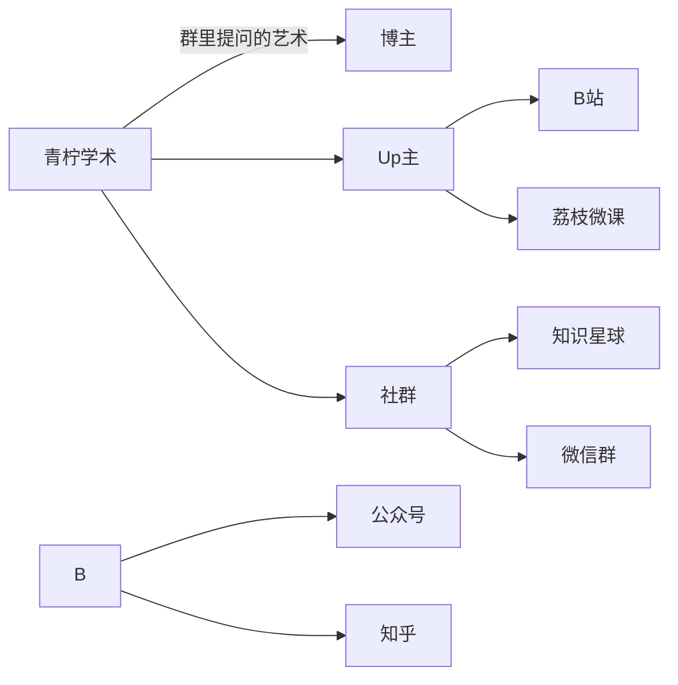

点击返回[🔗我的博客文章目录](https://percheung.github.io/#/toc)
* 目录
{:toc}

# Typora绘制思维导图

```mermaid
graph LR
A[青柠学术]-->|群里提问的艺术|博主
A-->C[Up主]
A-->D[社群]
B-->E[公众号]
B-->F[知乎]
C-->H[B站]
C-->I[荔枝微课]
D-->J[知识星球]
D-->K[微信群]
```

