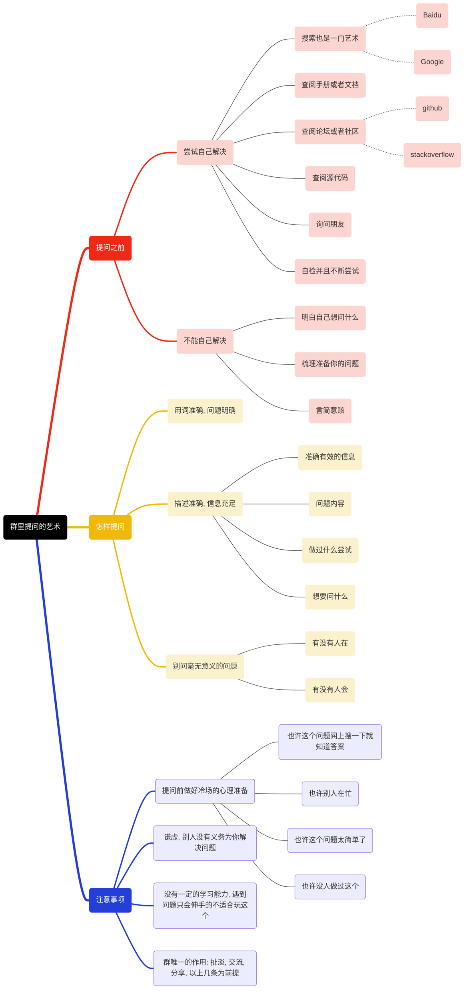

点击返回[🔗我的博客文章目录](https://percheung.github.io/#/toc)

* 目录
{:toc}

# Typora绘制思维导图

## 1.我要绘制的思维导图是什么样的？

在我的上一篇博客[群里提问的艺术](https://percheung.github.io/blog/群里提问的艺术)里，我画了这样一个思维导图。

> 本文的目标就是，用typora直接复现这个思维导图。

## 2.Typora绘制思维导图的思路

我们观察一下，其实思维导图就是树状结构的数据嘛，作为程序员，拿语言写树状结构的数据是很平常的事情。而且写代码可比画图省事多了，查阅资料可以知道，有一种`mermaid`语法，就是做这件事情的，支持 UML，甘特图，流程图等。

**重要的是，Typora就支持写mermaid。**

## 3.开始绘制

### 3.1 绘制前的准备工作（mermaid语法手册）

> 掌握原理是做事的第一步

Mermaid 是一种用于描述图表、流程图和时序图等的文本驱动的图形语言。它使用简洁的文本语法来定义图表结构，然后将其转换为可视化图形。

当使用Mermaid语法时，你可以使用一些关键字来定义不同类型的图形。下面是一些常用的关键字及其作用：

1. `[*]`：用于表示一个节点的形状为圆形，表示该节点是一个起始或结束节点。
2. `<|--`：用于表示继承关系，其中左侧的类或接口是右侧类或接口的子类或实现类。
3. `+`：在类图中，表示公共（public）属性或方法。
4. `-`：在类图中，表示私有（private）属性或方法。
5. `pie`：在流程图中，表示一个饼图节点，通常用于表示一个决策或选项的分支。
6. `graph`：用于指定图的方向。常见的方向有：`LR`（从左到右）、`RL`（从右到左）、`TB`（从上到下）、`BT`（从下到上）。
7. `||`：线上的文字。
8. `[]`：方形。
9. `{}`：菱形条件节点。
10. `()`：圆角矩形。
11. `(())`：圆形。
12. `>]`：不对称节点。
13. `---`：无箭头的实线。
14. `-.-`：无箭头的虚线。
15. `-.->`：有箭头的虚线。
16. `-->`：有箭头的实线。
17. `style`：用于定义节点和连接线的样式。
18. `fill`：设置节点或连接线的填充颜色。
19. `stroke`：设置节点或连接线的边框颜色。
20. `stroke-width`：设置节点或连接线的边框宽度。
21. `stroke-dasharray`：设置节点或连接线的边框为虚线样式，通过指定虚线段的长度。
22. `linkStyle`：用于设置连接线的样式。
23. `stroke`：设置连接线的颜色。
24. `stroke-width`：设置连接线的宽度。
25. `sequenceDiagram`：用于创建序列图。序列图展示了不同参与者之间的交互顺序，以及消息的发送和接收顺序。
26.  `classDiagram`：用于创建类图。类图展示了类、接口、属性和方法之间的关系，用于描述面向对象的结构。
27.  `participant`：在序列图中，用于定义参与者或对象。\
28.  `class`：在类图中，用于定义类或接口。
29.  `extends` 或 `<<extends>>`：在类图中，用于定义类的继承关系。
29.  `%%`：可以写行注释。

> 关于这些语法具体表现出来的简单图，可以参考下面这两篇博客，作者在博客里已经写得非常好了，里面有直接写语言后出来的图的样子，我就不重复造轮子了。

**1. 来自知乎，[使用 Typora 画图（类图、流程图、时序图）](https://zhuanlan.zhihu.com/p/172635547)**。

**2.来自菜鸟教程，[typora 画流程图、时序图(顺序图)、甘特图](https://www.runoob.com/note/47651)。**

**3.来自腾讯云，[mermaid 语法](https://cloud.tencent.com/developer/article/1334691)**。

### 3.2 绘制思维导图

> 下面直接写代码来讲解。

### 3.3 成品

#### 3.3.1 不去mermaid查看成品

> 部分网页因为对该语法适配不一样，不一定每个网页都适配这样的语法显示。所以贴个成品图放下面给各位看看效果，最后绘制出来的图挺大的，还是个svg的，只能截取部分出来看了，你也可以将上面的代码放到你typora里，在你本地看看效果。本文全部内容到此为止。

#### 3.3.2 去mermaid查看成品

原来mermaid（美人鱼）官网有一个在线编辑器，专门支持他家的mermaid语法在线显示，下面附上我的svg，更让我感到惊奇的是该链接居然没有被长城拦截，国内也可以很舒服的访问美人鱼网站。

[群里提问的艺术-来自mermaid（美人鱼）](https://www.mermaidchart.com/raw/03803400-c2bd-45af-84ca-0350d7094eb1?theme=light&version=v0.1&format=svg)

